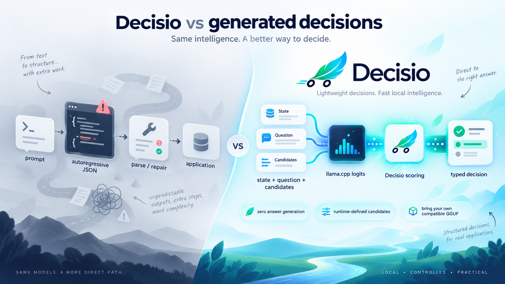
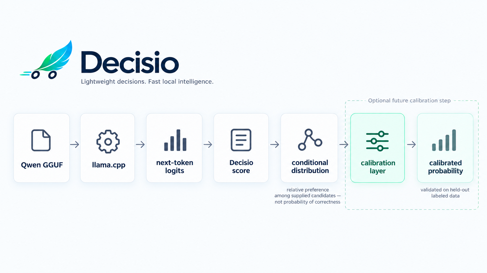
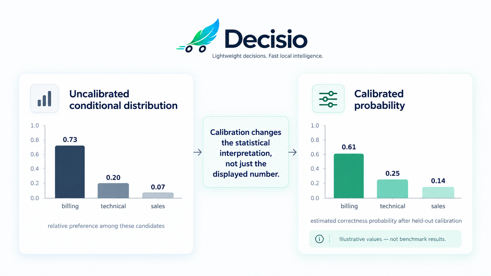
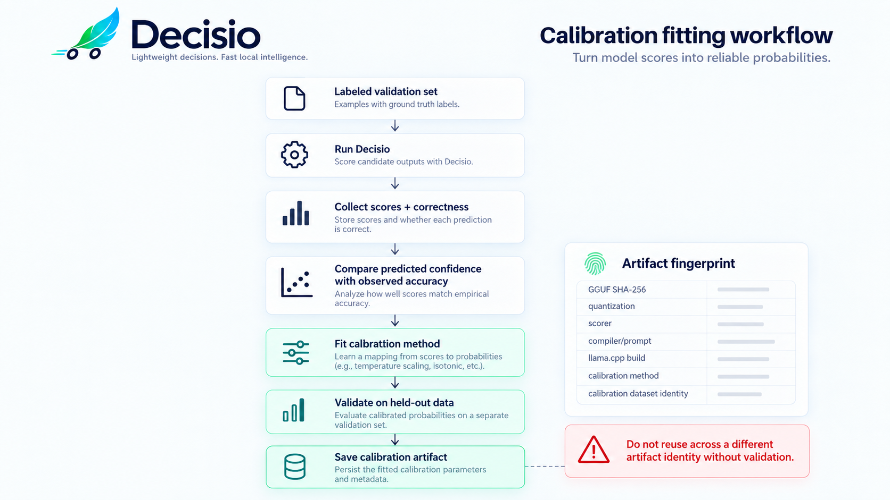
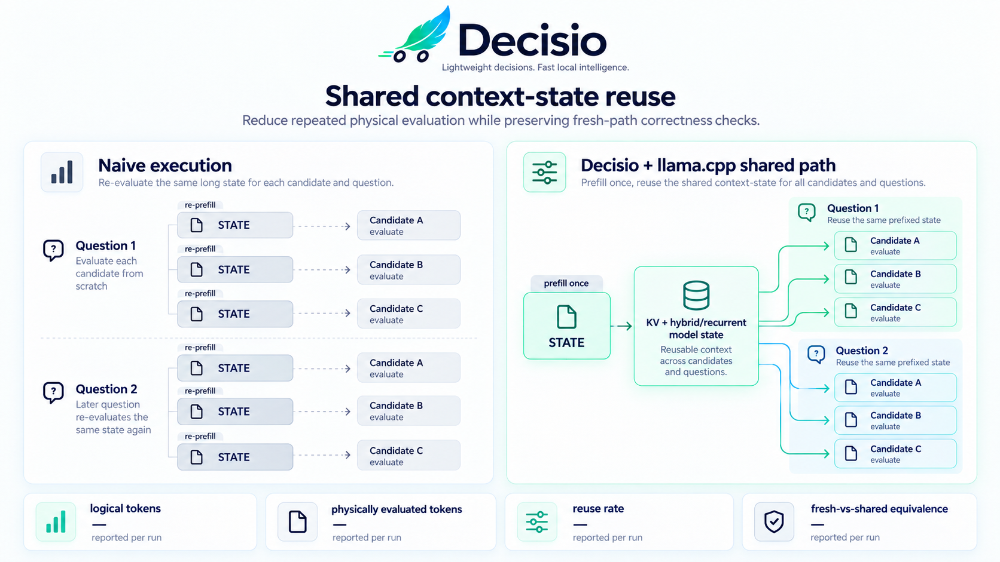
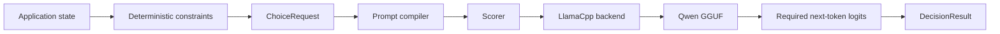

<p align="center">
  
</p>

<h1 align="center">Decisio</h1>

<p align="center">
  <strong>Turn a local open-weight LLM into a typed decision engine instead of making it generate an answer.</strong>
</p>

<p align="center">
  Training-free · zero answer tokens on native scoring · local GGUF + llama.cpp
</p>

<p align="center">
  <a href="https://github.com/daniele21/decisio/actions/workflows/ci.yml">
    
  </a>
  <a href="https://github.com/daniele21/decisio/actions/workflows/repository-health.yml">
    
  </a>
  = 3.11" src="https://img.shields.io/badge/Python-%E2%89%A53.11-112543?style=flat-square&logo=python&logoColor=white" />
  
  
  
  <a href="LICENSE">
    
  </a>
</p>

<p align="center">
  <a href="docs/README.md">Docs</a>
  · <a href="docs/architecture.md">Architecture</a>
  · <a href="docs/current-state.md">Current state</a>
  · <a href="benchmarks/README.md">Benchmarks</a>
  · <a href="examples/README.md">Examples</a>
  · <a href="CONTRIBUTING.md">Contributing</a>
</p>

Decisio takes application state, a question and runtime-defined candidates, then scores the candidates
directly from model logits. Native scoring generates **zero answer tokens** and requires **no
fine-tuning**.

The v1 runtime direction is local **GGUF + llama.cpp**. Qwen3.5-2B Q4_K_M is the reference artifact
for reproducible evidence, but it is not intended to be the only usable quantization: the goal is to
let developers bring a compatible quantized Qwen GGUF that fits their own hardware, memory and
quality trade-off.

<p align="center">
  
</p>

## Why

A lot of software does not need prose from an LLM. It needs a bounded decision:

- route a request;
- choose an action;
- classify into categories defined at runtime;
- interpret evidence against a small set of alternatives;
- eventually decide whether the supplied evidence is sufficient to answer.

The common pattern asks a model to generate JSON and immediately parses that text back into a
software decision.

Decisio explores a different primitive:

```text
state + question + valid candidates
                │
                ▼
        semantic candidate scoring
                │
                ▼
       typed relative distribution
```

The product hypothesis is simple:

> For bounded semantic decisions, use the LLM as a scorer before using it as a writer.

## Bring your own quantized Qwen

The runtime target is deliberately local and artifact-oriented:

```text
your compatible Qwen GGUF
        │
        ▼
     llama.cpp
        │
        ▼
      Decisio
        │
        ▼
typed semantic decision
```

You should be able to choose the quantized GGUF that makes sense for your machine instead of having
Decisio require one heavyweight model packaging stack.

For example, a user may prefer a smaller Q4 artifact for local CPU use or a higher-fidelity
quantization when memory allows. Decisio's scoring approach stays the same; the exact logits and
therefore quality, margins, latency and calibration can change with the artifact.

That distinction matters:

- **Q4_K_M is the v1 reference artifact**, not a permanent product restriction;
- other compatible Qwen GGUF quantizations are intended to be usable;
- quantizations are **not assumed equivalent**;
- benchmark evidence belongs to the exact GGUF/runtime identity that produced it;
- a calibration artifact must not silently transfer to a different GGUF/quantization.

This makes model choice a deployment decision while keeping scorer semantics and evidence explicit.

## Runtime status

Decisio now has an in-process local-GGUF llama.cpp backend on the product branch. The original
PyTorch/Transformers implementation remains migration-source code only; the representative 2B
llama.cpp scorer gate is still pending.

The local workflow is:

```bash
decisio compare \
  --input .artifacts/scorer-gate-v2.jsonl \
  --output-dir .artifacts/scorer-gate-v2 \
  --model /absolute/path/Qwen3.5-2B-Q4_K_M.gguf \
  --device cpu \
  --warmup-rounds 1 \
  --performance-rounds 4
```

This CLI is implemented but remains experimental until the pinned 2B llama.cpp scorer gate and
shared-context equivalence evidence pass.

See the active [llama.cpp runtime migration workstream](docs/workstreams/llama-cpp-reference-runtime.md)
and [current state](docs/current-state.md).

## What comes back

A native result contains a selected candidate plus raw/normalized model scores and provenance:

```json
{
  "choice": "billing",
  "distribution": {
    "billing": 0.91,
    "technical": 0.07,
    "sales": 0.02
  },
  "scores": {
    "billing": 4.2,
    "technical": 1.6,
    "sales": 0.3
  },
  "binary_conditional_probability": {
    "billing": 0.99,
    "technical": 0.83,
    "sales": 0.57
  },
  "probability_status": "uncalibrated_conditional_scores",
  "generated_tokens": 0
}
```

The numbers above illustrate the **output shape**, not a benchmark result.

The distribution means “relative preference among the supplied candidates under this scorer.” It is
**not** automatically a calibrated probability that the answer is correct.

GGUF/llama.cpp does not prevent calibration. A later calibration layer can be fitted over Decisio
scores, but the calibration artifact must match the exact model artifact, quantization,
scorer/compiler and runtime identity.

## From logits to calibrated probabilities

Decisio deliberately separates **model preference** from **probability of correctness**. The path is:

```text
Qwen GGUF
   │
   ▼
llama.cpp next-token logits
   │
   ▼
Decisio candidate scores
   │
   ▼
softmax across supplied candidates
   │
   ▼
uncalibrated conditional distribution
   │
   ▼
optional calibration artifact fitted on labeled validation data
   │
   ▼
calibrated probabilities
```

<p align="center">
  
</p>

### 1. llama.cpp gives Decisio logits

For semantic scoring, Decisio asks the model to judge one candidate against the complete candidate
set and reads the next-token logits for the configured binary verbalizers:

```text
YES logit = 8.2
NO  logit = 6.7

candidate score = 8.2 - 6.7 = 1.5
```

No answer token needs to be generated on the native scoring path.

The same operation is repeated for the other valid candidates. Suppose the resulting scores are:

```text
billing   = 2.4
technical = 1.1
sales     = -0.2
```

The semantic scorers now preserve this quantity as `binary_conditional_probability`. It is the
YES probability after renormalizing the model's YES/NO logits for that candidate; it is not a
calibrated correctness probability.

### 2. Softmax turns scores into a relative distribution

Decisio can normalize those scores across the supplied candidate set:

```text
softmax(scores)

billing   = 0.73
technical = 0.20
sales     = 0.07
```

This is useful, but its interpretation is deliberately narrow:

> Given this scorer, model artifact, prompt/compiler and candidate set, `billing` receives 73% of
> the relative score mass.

It does **not** yet mean:

> `billing` has a 73% probability of being correct.

That is why the result is labeled:

```json
{
  "probability_status": "uncalibrated_conditional_scores"
}
```

<p align="center">
  
</p>

### 3. Calibration learns the mapping from scores to observed correctness

Calibration is a separate post-hoc step. It needs a **labeled validation set that was not used to
fit or select the calibration parameters**.

For each validation example:

```text
known correct answer
        │
        ├──────────────┐
        ▼              │
run Decisio            │
        │              │
        ▼              │
predicted scores       │
and distribution       │
        │              │
        └──── compare ─┘
               │
               ▼
predicted confidence vs observed correctness
```

For example, if predictions around `0.80` are correct only about 65% of the time, the system is
over-confident in that region.

A calibration method can then learn a correction. One simple candidate is **temperature scaling**:

```text
calibrated_distribution = softmax(scores / T)
```

where `T` is fitted on held-out labeled examples rather than chosen by hand. Other calibration
methods may be evaluated later if they provide better evidence.

Calibration quality should be measured with appropriate held-out metrics such as NLL, Brier score,
reliability/calibration error and task-appropriate accuracy/coverage diagnostics. Calibration must
not be declared successful merely because probabilities look smoother.

<p align="center">
  
</p>

### 4. Calibration belongs to the exact decision engine identity

Calibration is not a generic property of “Qwen3.5-2B”. A Q4_K_M artifact and a Q8 artifact can
produce slightly different logits, margins and decision boundaries.

A future Decisio calibration artifact therefore needs to identify at least:

```text
GGUF SHA-256
quantization
scorer identity
compiler / prompt identity
readout verbalizers
llama.cpp runtime / build identity
calibration method
calibration dataset identity
```

Changing the GGUF or quantization does not prevent Decisio from running. It means the old calibration
must not automatically be treated as valid.

This is the intended model:

```text
                    Decisio scorer semantics
                              │
                ┌─────────────┼─────────────┐
                ▼             ▼             ▼
             Q4_K_M         Q6_K          Q8_0
                │             │             │
          own evidence   own evidence   own evidence
                │             │             │
      optional matching calibration artifacts
```

Qwen3.5-2B Q4_K_M is the first reference configuration so the project has one reproducible,
locally practical CPU baseline. The 2B choice is not a claim that it is universally better than 4B;
users remain free to choose another compatible quantized Qwen GGUF and measure the trade-off on
their own workload.

### 5. Calibrated output stays explicit

The current API exposes uncalibrated conditional scores. A future calibrated result should keep both
layers visible rather than overwrite one with the other:

```json
{
  "choice": "billing",
  "binary_conditional_probability": {
    "billing": 0.92,
    "technical": 0.71,
    "sales": 0.38
  },
  "distribution": {
    "billing": 0.73,
    "technical": 0.20,
    "sales": 0.07
  },
  "calibrated_probability": {
    "billing": 0.61,
    "technical": 0.25,
    "sales": 0.14
  },
  "probability_status": "temperature_scaled",
  "calibration_id": "qwen35-2b-q4km-semantic-v2-..."
}
```

This JSON is an **illustration of the intended future calibrated contract**, not implemented API or
benchmark evidence.

Calibration also does not solve every uncertainty problem. In particular, “which candidate is
preferred?” and “is there enough evidence to answer?” remain separate questions; Decisio plans to
treat answerability as its own signal rather than hide it inside candidate confidence.

## How the scorer works

The primary experimental scorer evaluates every valid candidate against the complete alternative set:

```text
candidate score = logit(Yes) - logit(No)
```

Candidate scores are normalized across the supplied set.

Applications must remove choices that are already known to be invalid before calling Decisio:

```text
domain rules
    ↓
valid candidates
    ↓
Decisio
    ↓
semantic preference
```

A probabilistic model should not overrule facts such as a wall collision, an invalid state transition
or an explicit authorization rule.

## Why shared context state matters

Zero answer generation removes decoding work, but repeated **prefill** can still dominate CPU
latency. Decisio therefore treats shared context-state reuse as part of the v1 runtime, not a later
micro-optimization.

```text
long state + question + alternatives
              │
         prefill once
              │
      reusable model state
       /       |       \
      A        B        C
      │        │        │
   YES/NO   YES/NO   YES/NO
```

For repeated decisions, the target is also to retain a bounded prefix state so a long unchanged
state is not recomputed for every new question.

<p align="center">
  
</p>

Fresh evaluation remains the oracle: the shared fast path becomes default only after it preserves
the same choice and keeps score/probability deltas within a declared tolerance.

## Target architecture



llama.cpp owns model execution. Decisio owns the decision semantics: compilation, scorer behavior,
probability status, provenance and evidence.

See [Architecture](docs/architecture.md) for the current implementation and migration boundary.

## Evidence before API expansion

Decisio compares four inference strategies on the same frozen workload:

- **semantic v2** — comparative Yes/No log-odds;
- **semantic v1** — candidate-independent Yes/No log-odds;
- **letters** — direct A/B/C next-token scoring;
- **generated JSON** — minimal autoregressive baseline.

The scorer gate measures quality, candidate-order sensitivity, invalid output and systems
performance. CPU runs use warm-up, repeated balanced trials, p50/p95 latency, throughput and process
peak-RSS reporting.

The original [scorer gate v1](benchmarks/scorer-gate-v1.md) is retained as the frozen
Transformers/BF16 methodology source, but it no longer authorizes scorer promotion. The llama.cpp
migration will freeze a gate-v2 GGUF/runtime identity before representative results are observed.

## Examples

- [Support routing](examples/support-routing/) — runtime-defined support queues.
- [Policy gate](examples/policy-gate/) — bounded semantic interpretation without replacing deterministic policy.
- [Snake](examples/snake/) — repeated action selection after deterministic unsafe moves are filtered.

Examples are behavioral probes, not benchmark claims.

## Status

Decisio is **experimental**.

Implemented now:

- comparative semantic v2 and independent v1;
- direct-letter and generated JSON baselines;
- deterministic prompt/readout compilation;
- frozen benchmark and paired-evidence tooling;
- provenance and candidate-order perturbation;
- current Transformers migration-source backend;
- real-model CPU smoke and trace-backed Snake evidence.

Active migration:

- real-model validation of the in-process llama.cpp backend;
- shared candidate-prefix branching (implemented) and bounded repeated-state cache (pending);
- fresh-vs-shared equivalence plus physical-token/reuse metrics;
- local-GGUF CLI path;
- exact GGUF/runtime provenance;
- scorer-gate v2 on CPU.

Still pending after the reference runtime is established:

- broader perturbation coverage;
- answerability;
- scaled multi-question scheduling;
- calibration;
- stable high-level Python API;
- representative release/runtime evidence.

## What Decisio is not

Decisio is not:

- a chat framework;
- a generic LLM server;
- a workflow or authorization engine;
- a claim that raw model scores are calibrated confidence;
- a claim that different quantizations are interchangeable;
- a fine-tuning framework in v1;
- a safety-critical decision authority without workload-specific validation.

## Documentation

- [Product scope](docs/product.md)
- [Architecture](docs/architecture.md)
- [Current state](docs/current-state.md)
- [Active llama.cpp workstream](docs/workstreams/llama-cpp-reference-runtime.md)
- [Roadmap](docs/roadmap.md)
- [Repository quality plan](docs/repository-quality.md)
- [Benchmarks](benchmarks/README.md)
- [Examples](examples/README.md)
- [Contributing](CONTRIBUTING.md)
- [Security](SECURITY.md)

Licensed under [Apache-2.0](LICENSE).
