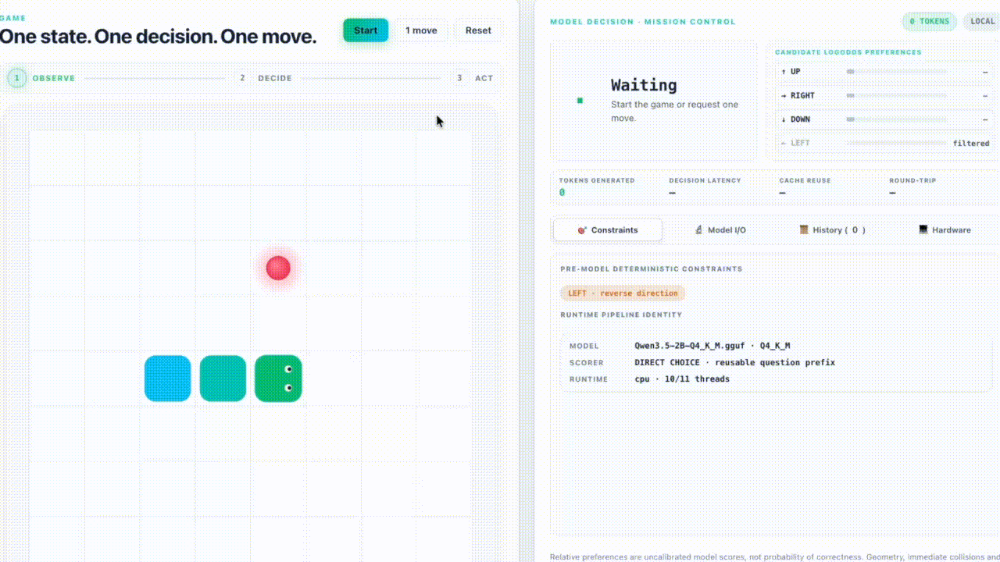
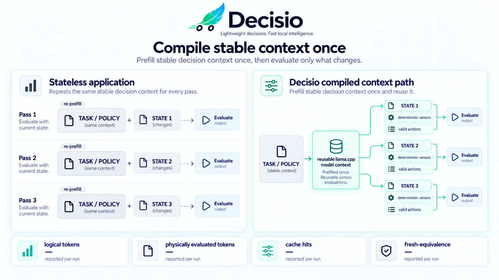
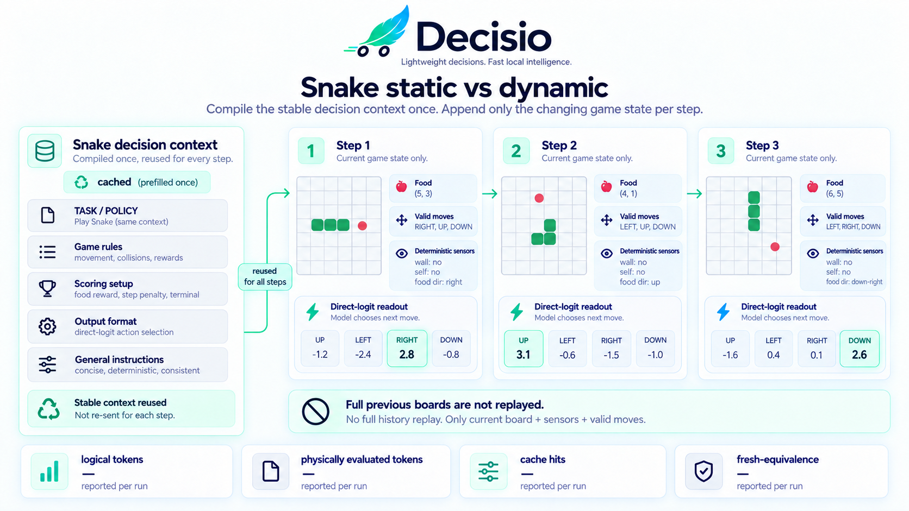
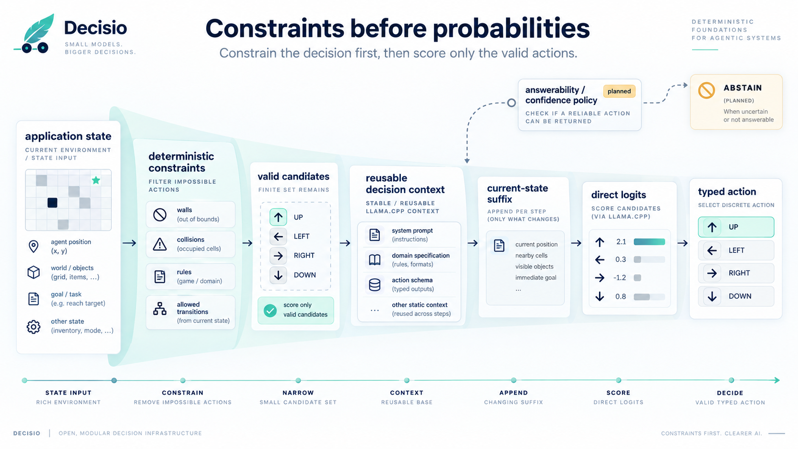
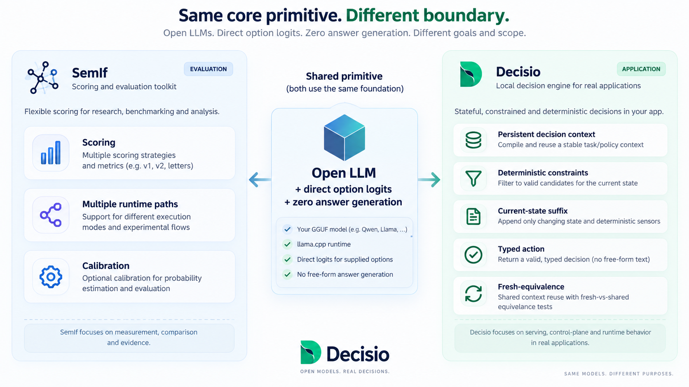

<p align="center">
  
</p>

<h1 align="center">Decisio</h1>

<p align="center">
  <strong>Make repeated local-LLM decisions without re-prefilling the same context every time.</strong>
</p>

<p align="center">
  Prefill stable context once · reuse model state · send only changing state · return a typed action
</p>

<p align="center">
  <a href="https://github.com/daniele21/decisio/actions/workflows/ci.yml">
    
  </a>
  <a href="https://github.com/daniele21/decisio/actions/workflows/repository-health.yml">
    
  </a>
  
  
  
  
  <a href="LICENSE">
    
  </a>
</p>

<p align="center">
  <a href="docs/README.md">Docs</a>
  · <a href="docs/architecture.md">Architecture</a>
  · <a href="docs/current-state.md">Current state</a>
  · <a href="benchmarks/README.md">Benchmarks</a>
  · <a href="examples/README.md">Examples</a>
  · <a href="CONTRIBUTING.md">Contributing</a>
</p>

<p align="center">
  <a href="brand/assets/decisio.mp4">
    
  </a>
</p>

Decisio is a stateful decision runtime for applications that ask a local LLM to make the
**same kind of bounded decision many times while the world state changes**.

The core idea is simple:

> **Keep the stable task and policy warm. Send only what changed.**

Decisio separates a reusable decision prefix from the current-state suffix, reuses the corresponding
llama.cpp model state when that prefix is still valid, and reads the selected action directly from
model logits. The native path generates **zero answer tokens**.

## Why this exists

A normal stateless loop pays for the same long prefix again and again:

```text
WITHOUT DECISIO

task + policy + STATE 1  ->  prefill  ->  action
task + policy + STATE 2  ->  prefill  ->  action
task + policy + STATE 3  ->  prefill  ->  action

reprocessed every time
```

Decisio makes that stable prefix a runtime resource:

```text
WITH DECISIO

task + policy  ->  PREFILL ONCE  ->  reusable model state
                                      /       |       \
                                 STATE 1   STATE 2   STATE 3
                                    |         |         |
                                  action    action    action
```

The main benefit is **less repeated prefill work** for repeated decision loops. Zero answer
generation removes the decoding loop too, but it is not the main product thesis.

<p align="center">
  
</p>

### Is this "KV cache reuse"?

At a high level, **yes: KV-cache reuse is the performance idea people should have in mind**.
If the prompt prefix is unchanged, do not recompute that prefix for every decision.

The implementation uses the more precise term **reusable model state/context**. The llama.cpp
backend snapshots and restores complete single-sequence state instead of assuming that every piece
of reusable Qwen state is only a conventional K/V tensor cache.

Reuse is prefix-safe, observable and checked against fresh execution. It is not a semantic cache that
can patch arbitrary earlier prompt changes.

## Try it

The shortest path is the Snake demo. It makes the static/dynamic split visible on every move.

Prerequisites: Python 3.11+, [uv](https://docs.astral.sh/uv/) and `curl`.

```bash
git clone https://github.com/daniele21/decisio.git
cd decisio

uv sync --frozen --extra llama --extra dev

mkdir -p .models
curl -L \
  "https://huggingface.co/unsloth/Qwen3.5-0.8B-GGUF/resolve/91840701981c3152e23662fa4416d7a93cab90e2/Qwen3.5-0.8B-Q4_K_M.gguf?download=true" \
  -o .models/Qwen3.5-0.8B-Q4_K_M.gguf

uv run python -m examples.snake.web \
  --model "$PWD/.models/Qwen3.5-0.8B-Q4_K_M.gguf" \
  --scorer direct \
  --open
```

The 0.8B artifact above is the small pinned real-model smoke model, useful for trying the project
quickly. Repository benchmark claims use their own exact model/runtime identity; the current primary
reference artifact is Qwen3.5-2B Q4_K_M.

In the Snake UI, look for:

- the current board and deterministic sensors;
- actions removed before the model is asked to choose;
- the actual input used for that move;
- direct option scores and the selected typed action;
- latency and context-reuse metrics;
- logical input tokens versus physically evaluated tokens.

Snake reuse is enabled by default. Use `--fresh-prefix` when you want the same stateful prompt
evaluated without prefix reuse for comparison.

For a non-visual request:

```bash
uv run decisio score \
  --input examples/support-routing/request.json \
  --model "$PWD/.models/Qwen3.5-0.8B-Q4_K_M.gguf" \
  --device cpu
```

## Snake: the idea in one loop

Snake is the reference example because it naturally contains both stable and changing information.

```text
STABLE FOR THE EPISODE                 CHANGES EVERY STEP
----------------------                 ------------------
objective                              head / body / food
coordinate convention        +         valid actions
sensor meanings                        projected exits
decision priorities                    reachable area
                                       recent-visit sensor
          |                                  |
          +------ reusable context ----------+
                          |
                    A / B / C logits
                          |
                      typed move
```

The full previous board history is not replayed. The stable decision contract stays reusable; the
current board and deterministic sensors describe only the state that matters now.

<!-- SNAKE_DEMO_VIDEO_START -->

> [!NOTE]
> The live execution recording is featured at the top of this README. You can also view the full high-resolution recording directly in [`brand/assets/decisio.mp4`](brand/assets/decisio.mp4).

<!-- SNAKE_DEMO_VIDEO_END -->

<p align="center">
  
</p>

## How Decisio works

A repeated decision goes through four boundaries:

```text
1. STABLE CONTEXT
   task + policy + sensor meanings
               |
               v
        prefill / restore
               |
               v
2. CURRENT STATE
   dynamic state + deterministic sensors
               |
               v
3. VALID CANDIDATES
   impossible actions already removed
               |
               v
4. DIRECT READOUT
   selected option logits -> typed action
```

### 1. Split stable context from changing state

The application decides what can safely remain identical across many decisions. That stable prefix is
compiled so the runtime can reuse its model state.

### 2. Keep deterministic truth in software

The model should not rediscover facts the application already knows.

For Snake, wall collision, body collision and reverse-direction failures are filtered before model
scoring. The same rule applies to authorization checks, impossible state transitions and other
deterministic domain constraints.

<p align="center">
  
</p>

### 3. Reuse only valid model state

If an earlier token changes, downstream cached state may no longer be valid. Decisio therefore
reuses only exact/prefix-safe context under explicit compiler/runtime rules.

### 4. Read the decision instead of generating an answer

For a small bounded action set, Decisio can render the valid actions as A/B/C/... and read the
corresponding next-token logits from one model evaluation:

```text
A. UP
B. RIGHT
C. DOWN

logit(A), logit(B), logit(C)
              |
              v
          typed move
```

No answer string has to be generated and parsed.

## Correctness before cache hits

A cache hit is useful only when the optimized path preserves the fresh result.

Stateful validation therefore compares reuse with a fresh oracle and records:

```text
same choice
score / probability delta
logical input tokens
physically evaluated tokens
reused prefix tokens
cache hits / misses
latency
bounded context-state bytes
```

The performance claim is therefore not "we cached something". It is:

> **We reused model computation, reduced physical work, and preserved the fresh decision within the
> declared equivalence contract.**

Current real-model measurements, exact artifact identities and failed gates live in
[Current state](docs/current-state.md) and [Benchmarks](benchmarks/README.md).

## Where it fits

Decisio is designed for repeated, bounded decisions where a meaningful part of the prompt remains
stable:

| Workload | Stable context | Changing state | Typed action |
| --- | --- | --- | --- |
| Snake / control loop | objective + policy + sensors | current board | UP / RIGHT / DOWN |
| Support routing | routing policy + queue meanings | new ticket | queue ID |
| Triage | rubric + definitions | new evidence | next action |
| Policy gate | policy semantics | current request | allow / deny / escalate |

It is less interesting when every request is unrelated, when the output genuinely needs free-form
generation, or when there is no stable prefix worth reusing.

## Target architecture


**llama.cpp** owns model execution and context mechanics.

**Decisio** owns the stable/dynamic decision boundary, deterministic compilation, readout semantics,
reuse correctness, probability status, provenance and evidence.

The high-level `DecisionSession` API is not yet a promoted stable public contract. The current
reference implementation proves the lower-level runtime behavior first.

See [Architecture](docs/architecture.md) for the detailed boundary.

## Bring your own quantized Qwen

v1 is deliberately local and artifact-oriented:

```text
compatible Qwen GGUF
        |
        v
     llama.cpp
        |
        v
      Decisio
        |
        v
typed local decision
```

Qwen3.5-2B Q4_K_M is the pinned primary reference evidence artifact, not a permanent product
restriction. A smaller compatible GGUF can be useful for local experimentation.

Different quantizations are not assumed equivalent. They can change logits, choices, latency,
memory and calibration, so evidence belongs to the exact model artifact and runtime identity that
produced it.

## Direct logits are a primitive, not the differentiator

Reading a bounded option directly from logits is useful, but Decisio does not claim that primitive as
its unique contribution.

The product boundary is the repeated decision loop around it:

```text
stable decision context
        +
deterministic constraints
        +
current-state suffix
        +
fresh-equivalent model-state reuse
        +
typed action
```

A separate comparative semantic-v2 scorer also exists for experiments. It is **not** the general
default: its frozen short/fresh gate failed the precommitted general-purpose criteria. Repeated-state
experiments remain a scoped evidence lane.

## How this differs from SemIf

[SemIf](https://github.com/TheoLeeCJ/SemIf) also explores direct typed option scoring, shared-state
execution, multiple runtime paths and calibration.

| | SemIf emphasis | Decisio emphasis |
| --- | --- | --- |
| Core primitive | direct typed option scoring | direct scoring is an internal readout primitive |
| Repeated state | shared-state scoring/reuse | stable decision context is a first-class runtime resource |
| Application boundary | score the supplied decision | constraints → current state → typed application action |
| Runtime breadth | multiple runtime/model paths | opinionated local GGUF + llama.cpp v1 |
| Reuse contract | execution optimization | fresh-equivalent reuse is a product invariant |
| Output contract | option scores/probabilities | typed action + provenance; abstention planned |

The shorthand is:

> **SemIf:** score this decision efficiently.  
> **Decisio:** keep my application's decision context warm while the state changes.

<p align="center">
  
</p>

## Scores are not calibrated confidence

A native result exposes a selected candidate plus scores/distribution and provenance. The
distribution means **relative preference among the supplied candidates under this scorer**.

It does not automatically mean "probability that this answer is correct".

```json
{
  "choice": "billing",
  "distribution": {
    "billing": 0.73,
    "technical": 0.20,
    "sales": 0.07
  },
  "probability_status": "uncalibrated_conditional_scores",
  "generated_tokens": 0
}
```

The numbers above illustrate the shape, not a benchmark result. See
[Calibration and probability semantics](docs/calibration.md) for the detailed model.

## Current status

Decisio is **experimental**.

Implemented now:

- local GGUF + llama.cpp execution;
- stable-context model-state reuse with fresh-path correctness checks;
- bounded repeated-state context cache and runtime instrumentation;
- direct A/B/C choice logits with zero generated answer tokens;
- deterministic constraints-before-score examples;
- exact model/runtime provenance;
- frozen benchmark/evaluation tooling;
- live Snake UI plus trace/video evidence generation.

Still planned or experimental:

- stable high-level `DecisionSession` API;
- answerability/abstention contract;
- calibration artifacts;
- broader controller-quality and perturbation coverage;
- scaled scheduling of many decisions over shared context;
- representative release-grade evidence.

Runtime/cache efficiency does not by itself prove decision quality. Raw normalized scores are not
calibrated correctness probabilities, and benchmark claims remain tied to exact artifact/runtime
identities.

## What Decisio is not

Decisio is not a chat framework, generic LLM server, workflow engine, arbitrary semantic cache or
fine-tuning framework. It does not claim that different quantizations are interchangeable, and it
should not be treated as a safety-critical decision authority without workload-specific validation.

## Documentation

- [Product scope](docs/product.md)
- [Architecture](docs/architecture.md)
- [Current state](docs/current-state.md)
- [Calibration](docs/calibration.md)
- [Roadmap](docs/roadmap.md)
- [Benchmarks](benchmarks/README.md)
- [Examples](examples/README.md)
- [Contributing](CONTRIBUTING.md)
- [Security](SECURITY.md)

Licensed under [Apache-2.0](LICENSE).
