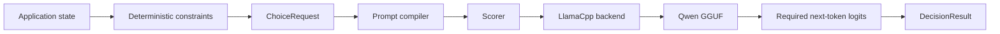

# Decisio

**Turn a local open-weight LLM into a typed decision engine instead of making it generate an answer.**

Decisio takes application state, a question and runtime-defined candidates, then scores the candidates
directly from model logits. Native scoring generates **zero answer tokens** and requires **no
fine-tuning**.

The v1 runtime direction is local **GGUF + llama.cpp**. Qwen3.5-4B Q4_K_M is the reference artifact
for reproducible evidence, but it is not intended to be the only usable quantization: the goal is to
let developers bring a compatible quantized Qwen GGUF that fits their own hardware, memory and
quality trade-off.

> **IMAGE PLACEHOLDER — Decisio vs generated decisions**  
> Create a clean two-column diagram. Left: `prompt → autoregressive JSON → parse/repair → application`.
> Right: `state + question + candidates → llama.cpp logits → Decisio scoring → typed decision`.
> Highlight “zero answer generation”, “runtime-defined candidates” and “bring your own compatible
> GGUF”. Do not include performance claims until representative benchmark evidence exists.

## Why

A lot of software does not need prose from an LLM. It needs a bounded decision:

- route a request;
- choose an action;
- classify into categories defined at runtime;
- interpret evidence against a small set of alternatives;
- eventually decide whether the supplied evidence is sufficient to answer.

The common pattern asks a model to generate JSON and immediately parses that text back into a
software decision.

Decisio explores a different primitive:

```text
state + question + valid candidates
                │
                ▼
        semantic candidate scoring
                │
                ▼
       typed relative distribution
```

The product hypothesis is simple:

> For bounded semantic decisions, use the LLM as a scorer before using it as a writer.

## Bring your own quantized Qwen

The runtime target is deliberately local and artifact-oriented:

```text
your compatible Qwen GGUF
        │
        ▼
     llama.cpp
        │
        ▼
      Decisio
        │
        ▼
typed semantic decision
```

You should be able to choose the quantized GGUF that makes sense for your machine instead of having
Decisio require one heavyweight model packaging stack.

For example, a user may prefer a smaller Q4 artifact for local CPU use or a higher-fidelity
quantization when memory allows. Decisio's scoring approach stays the same; the exact logits and
therefore quality, margins, latency and calibration can change with the artifact.

That distinction matters:

- **Q4_K_M is the v1 reference artifact**, not a permanent product restriction;
- other compatible Qwen GGUF quantizations are intended to be usable;
- quantizations are **not assumed equivalent**;
- benchmark evidence belongs to the exact GGUF/runtime identity that produced it;
- a calibration artifact must not silently transfer to a different GGUF/quantization.

This makes model choice a deployment decision while keeping scorer semantics and evidence explicit.

## Runtime status

Decisio is currently migrating from its initial PyTorch/Transformers reference implementation to
an in-process llama.cpp backend.

The current executable Transformers path established the scorer/compiler semantics. It is now
migration-source code, not the authority for selecting the stable scorer.

The target local workflow is:

```bash
decisio compare \
  --input .artifacts/scorer-gate-v2.jsonl \
  --output-dir .artifacts/scorer-gate-v2 \
  --model /absolute/path/Qwen3.5-4B-Q4_K_M.gguf \
  --device cpu \
  --warmup-rounds 1 \
  --performance-rounds 4
```

That command shape is the **target interface under active implementation**, not yet the stable public
CLI contract.

See the active [llama.cpp runtime migration workstream](docs/workstreams/llama-cpp-reference-runtime.md)
and [current state](docs/current-state.md).

## What comes back

A native result contains a selected candidate plus raw/normalized model scores and provenance:

```json
{
  "choice": "billing",
  "distribution": {
    "billing": 0.91,
    "technical": 0.07,
    "sales": 0.02
  },
  "scores": {
    "billing": 4.2,
    "technical": 1.6,
    "sales": 0.3
  },
  "probability_status": "uncalibrated_conditional_scores",
  "generated_tokens": 0
}
```

The numbers above illustrate the **output shape**, not a benchmark result.

The distribution means “relative preference among the supplied candidates under this scorer.” It is
**not** automatically a calibrated probability that the answer is correct.

GGUF/llama.cpp does not prevent calibration. A later calibration layer can be fitted over Decisio
scores, but the calibration artifact must match the exact model artifact, quantization,
scorer/compiler and runtime identity.

## How the scorer works

The primary experimental scorer evaluates every valid candidate against the complete alternative set:

```text
candidate score = logit(Yes) - logit(No)
```

Candidate scores are normalized across the supplied set.

Applications must remove choices that are already known to be invalid before calling Decisio:

```text
domain rules
    ↓
valid candidates
    ↓
Decisio
    ↓
semantic preference
```

A probabilistic model should not overrule facts such as a wall collision, an invalid state transition
or an explicit authorization rule.

## Target architecture



llama.cpp owns model execution. Decisio owns the decision semantics: compilation, scorer behavior,
probability status, provenance and evidence.

See [Architecture](docs/architecture.md) for the current implementation and migration boundary.

## Evidence before API expansion

Decisio compares four inference strategies on the same frozen workload:

- **semantic v2** — comparative Yes/No log-odds;
- **semantic v1** — candidate-independent Yes/No log-odds;
- **letters** — direct A/B/C next-token scoring;
- **generated JSON** — minimal autoregressive baseline.

The scorer gate measures quality, candidate-order sensitivity, invalid output and systems
performance. CPU runs use warm-up, repeated balanced trials, p50/p95 latency, throughput and process
peak-RSS reporting.

The original [scorer gate v1](benchmarks/scorer-gate-v1.md) is retained as the frozen
Transformers/BF16 methodology source, but it no longer authorizes scorer promotion. The llama.cpp
migration will freeze a gate-v2 GGUF/runtime identity before representative results are observed.

## Examples

- [Support routing](examples/support-routing/) — runtime-defined support queues.
- [Policy gate](examples/policy-gate/) — bounded semantic interpretation without replacing deterministic policy.
- [Snake](examples/snake/) — repeated action selection after deterministic unsafe moves are filtered.

Examples are behavioral probes, not benchmark claims.

## Status

Decisio is **experimental**.

Implemented now:

- comparative semantic v2 and independent v1;
- direct-letter and generated JSON baselines;
- deterministic prompt/readout compilation;
- frozen benchmark and paired-evidence tooling;
- provenance and candidate-order perturbation;
- current Transformers migration-source backend;
- real-model CPU smoke and trace-backed Snake evidence.

Active migration:

- Qwen3.5-4B Q4_K_M GGUF compatibility spike;
- in-process llama.cpp backend;
- local-GGUF CLI path;
- exact GGUF/runtime provenance;
- scorer-gate v2 on CPU.

Still pending after the reference runtime is established:

- broader perturbation coverage;
- answerability;
- shared state/question reuse;
- calibration;
- stable high-level Python API;
- representative release/runtime evidence.

## What Decisio is not

Decisio is not:

- a chat framework;
- a generic LLM server;
- a workflow or authorization engine;
- a claim that raw model scores are calibrated confidence;
- a claim that different quantizations are interchangeable;
- a fine-tuning framework in v1;
- a safety-critical decision authority without workload-specific validation.

## Documentation

- [Product scope](docs/product.md)
- [Architecture](docs/architecture.md)
- [Current state](docs/current-state.md)
- [Active llama.cpp workstream](docs/workstreams/llama-cpp-reference-runtime.md)
- [Roadmap](docs/roadmap.md)
- [Repository quality plan](docs/repository-quality.md)
- [Benchmarks](benchmarks/README.md)
- [Examples](examples/README.md)
- [Contributing](CONTRIBUTING.md)
- [Security](SECURITY.md)

Licensed under [Apache-2.0](LICENSE).
