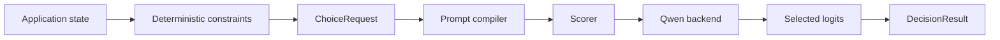

# Decisio

**Use an open-weight LLM as a decision scorer instead of making it generate an answer.**

Decisio takes application state, a question and runtime-defined candidates, then returns a typed relative decision distribution from model logits. The native scoring path generates **zero answer tokens** and requires **no fine-tuning**.

> **IMAGE PLACEHOLDER — Decisio vs generated decisions**  
> Create a clean two-column diagram. Left: `prompt → autoregressive JSON → parse/repair → application`. Right: `state + question + candidates → logit scoring → typed decision`. Highlight “zero answer generation” and “runtime-defined candidates”. Do not include performance claims until representative benchmark evidence exists.

## Why

A lot of software does not need prose from an LLM. It needs a bounded decision:

- route a request;
- choose an action;
- classify into categories defined at runtime;
- interpret evidence against a small set of alternatives;
- eventually decide whether the supplied evidence is sufficient to answer.

The usual pattern asks a model to generate JSON and immediately parses that text back into a software decision.

Decisio explores a different primitive:

```text
state + question + valid candidates
                │
                ▼
        semantic candidate scoring
                │
                ▼
       typed relative distribution
```

The product hypothesis is simple:

> For bounded semantic decisions, use the LLM as a scorer before using it as a writer.

## Quickstart

Decisio is currently an experimental Python package. Python 3.11+ is supported.

```bash
uv sync --extra qwen --extra dev
```

For a cheap **functional smoke** on CPU, use the smaller Qwen3.5-0.8B checkpoint:

```bash
uv run decisio score \
  --input examples/support-routing/request.json \
  --scorer semantic \
  --model Qwen/Qwen3.5-0.8B \
  --revision 2fc06364 \
  --device cpu \
  --dtype bfloat16
```

That command proves the real model/compiler/scorer path works. It is **not** representative quality or performance evidence.

The reference target for product evidence is pinned **Qwen3.5-4B BF16 on CUDA**.

## What comes back

A native result contains a selected candidate plus raw/normalized model scores and provenance:

```json
{
  "choice": "billing",
  "distribution": {
    "billing": 0.91,
    "technical": 0.07,
    "sales": 0.02
  },
  "scores": {
    "billing": 4.2,
    "technical": 1.6,
    "sales": 0.3
  },
  "probability_status": "uncalibrated_conditional_scores",
  "generated_tokens": 0
}
```

The numbers above illustrate the **output shape**, not a benchmark result.

The distribution means “relative preference among the supplied candidates under this scorer.” It is **not** a calibrated probability that the answer is correct.

## How the current scorer works

The primary experimental scorer evaluates every valid candidate against the complete alternative set:

```text
candidate score = logit(Yes) - logit(No)
```

The candidate scores are normalized across the supplied set.

Applications must remove choices that are already known to be invalid before calling Decisio:

```text
domain rules
    ↓
valid candidates
    ↓
Decisio
    ↓
semantic preference
```

A probabilistic model should not overrule facts such as a wall collision, an invalid state transition or an explicit authorization rule.

## Current architecture



See [Architecture](docs/architecture.md) for the implemented owners and the separately labeled target architecture.

## Evidence before API expansion

Decisio currently compares four inference strategies on the same frozen workload:

- **semantic v2** — comparative Yes/No log-odds;
- **semantic v1** — candidate-independent Yes/No log-odds;
- **letters** — direct A/B/C next-token scoring;
- **generated JSON** — minimal autoregressive baseline.

The scorer gate measures quality, candidate-order sensitivity, invalid output and systems performance. Representative performance runs use warm-up, repeated balanced trials, CUDA synchronization, throughput and peak-memory reporting.

See [Benchmark methodology](benchmarks/scorer-gate-v1.md).

## Examples

- [Support routing](examples/support-routing/) — runtime-defined support queues.
- [Policy gate](examples/policy-gate/) — bounded semantic interpretation without replacing deterministic policy.
- [Snake](examples/snake/) — repeated action selection after deterministic unsafe moves are filtered.

Examples are behavioral probes, not benchmark claims.

## Status

Decisio is **experimental**.

Implemented now:

- comparative semantic v2 and independent v1;
- direct-letter and generated JSON baselines;
- deterministic prompt/readout compilation;
- Qwen3.5 Transformers backend;
- candidate batching and selected-vocabulary projection;
- CLI and frozen benchmark tooling;
- auditable model/scorer/prompt provenance;
- real-model CPU integration smoke.

Still pending before the scoring approach is considered stable:

- full Qwen3.5-4B BF16/CUDA scorer gate;
- broader perturbation coverage;
- answerability;
- shared-prefix/cache reuse;
- stable high-level Python API;
- representative release/runtime evidence.

## What Decisio is not

Decisio is not:

- a chat framework;
- a generic LLM server;
- a workflow or authorization engine;
- a claim that raw model scores are calibrated confidence;
- a fine-tuning framework in v1;
- a safety-critical decision authority without workload-specific validation.

## Documentation

- [Product scope](docs/product.md)
- [Architecture](docs/architecture.md)
- [Current state](docs/current-state.md)
- [Roadmap](docs/roadmap.md)
- [Repository quality plan](docs/repository-quality.md)
- [Benchmarks](benchmarks/README.md)
- [Examples](examples/README.md)
- [Contributing](CONTRIBUTING.md)
- [Security](SECURITY.md)

Licensed under [Apache-2.0](LICENSE).
