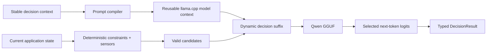

<p align="center">
  
</p>

<h1 align="center">Decisio</h1>

<p align="center">
  <strong>A stateful decision runtime for local LLMs: compile stable context once, then make typed decisions over changing state.</strong>
</p>

<p align="center">
  Training-free · stateful context reuse · zero answer tokens · local GGUF + llama.cpp
</p>

<p align="center">
  <a href="https://github.com/daniele21/decisio/actions/workflows/ci.yml">
    
  </a>
  <a href="https://github.com/daniele21/decisio/actions/workflows/repository-health.yml">
    
  </a>
  = 3.11" src="https://img.shields.io/badge/Python-%E2%89%A53.11-112543?style=flat-square&logo=python&logoColor=white" />
  
  
  
  <a href="LICENSE">
    
  </a>
</p>

<p align="center">
  <a href="docs/README.md">Docs</a>
  · <a href="docs/architecture.md">Architecture</a>
  · <a href="docs/current-state.md">Current state</a>
  · <a href="benchmarks/README.md">Benchmarks</a>
  · <a href="examples/README.md">Examples</a>
  · <a href="CONTRIBUTING.md">Contributing</a>
</p>

Decisio is for applications that repeatedly ask a local LLM to choose among a bounded set of valid
actions.

Instead of treating every decision as a fresh prompt, Decisio makes the **stable decision context**
a runtime resource: task semantics, policy and sensor meanings can be prefetched once into reusable
llama.cpp model context, while the changing application state and valid actions remain a dynamic
suffix.

Native scoring reads the required next-token logits directly and generates **zero answer tokens**.

> **Product shorthand:** compile stable context once; make many typed local decisions.

## The idea in 30 seconds

```text
STABLE FOR MANY DECISIONS
task + policy + sensor semantics
              |
         prefill once
              |
     reusable model context
              |
              +-------------------+
                                  |
CHANGES EACH DECISION             |
current state                     |
+ deterministic sensors           |
+ valid actions ------------------+
              |
              v
      direct choice readout
              |
              v
         typed action
```

The model does not own deterministic truth. The application removes impossible actions first;
Decisio scores only the remaining semantic trade-off.

```text
deterministic facts        stable semantics             uncertain choice
-------------------        ----------------             ----------------
wall collision        ->   Snake decision policy   ->   RIGHT vs UP
authorization rule         sensor meanings              route A vs B
invalid transition         task objective               retry vs escalate
```

> **IMAGE PLACEHOLDER — Compile stable context once**
> Show two panels. Left: a stateless application repeats the same large TASK/POLICY block together
> with STATE 1, STATE 2 and STATE 3; label each pass “re-prefill”. Right: Decisio prefills the stable
> decision context once into “reusable llama.cpp model context” and appends only changing state,
> deterministic sensors and valid actions. Show logical tokens, physically evaluated tokens, cache
> hits and fresh-equivalence. Do not print an unmeasured speedup.

## Snake demo

Snake is the reference example because the boundary is easy to see:

- the objective, coordinate convention and sensor meanings stay stable for the episode;
- head/body/food and projected action sensors change every step;
- wall, body and reverse-direction failures are removed deterministically;
- Qwen chooses only among the remaining valid actions;
- the direct scorer reuses the fixed decision context and returns a typed move.

<!-- SNAKE_DEMO_VIDEO_START -->

> **VIDEO PLACEHOLDER — Stateful Snake demo**
>
> Replace this block with the trace-backed real-model Snake demo.
> Prefer an embedded GIF/WebM preview that links to the full MP4 evidence artifact.
> The video should visibly pair the board with:
> current model input, valid candidates, selected action, latency, cache hit/reuse and
> logical-vs-physical token counts.
> Keep the clip short enough to understand the OBSERVE → CONSTRAIN → DECIDE → ACT loop at a glance.

<!-- SNAKE_DEMO_VIDEO_END -->

```text
STATIC FOR THE EPISODE                 CHANGES EVERY STEP
----------------------                 ------------------
Snake objective                        head/body/food
coordinate convention        +         valid actions
sensor definitions                      projected exits
decision priorities                      reachable area
                                        recent-visit sensor
          |                                  |
          +------ reusable context ----------+
                          |
                       A/B/C logits
                          |
                       typed move
```

> **IMAGE PLACEHOLDER — Snake static vs dynamic**
> Show a cached left column named “Snake decision context” and a stream of Step 1 / Step 2 / Step 3
> cards containing only current board, food, valid moves and deterministic sensors. Under each step
> show one direct-logit readout. Highlight that full previous boards are not replayed.

## Why stateful matters

Zero answer generation removes decoding work, but on local CPU inference the **prefill** of a long
repeated context can still dominate a decision loop.

A stateless application does this:

```text
task + policy + state 1 -> model -> action
task + policy + state 2 -> model -> action
task + policy + state 3 -> model -> action
```

A stateful Decisio path aims for:

```text
task + policy -> reusable model context
                      |
          +-----------+-----------+
          |           |           |
       state 1     state 2     state 3
          |           |           |
       action      action      action
```

The optimization is accepted only when it preserves the fresh path.

That means state reuse is not a semantic cache and it is not arbitrary mutation of a transformer
context. If an earlier token changes, downstream cached model state may be invalid. Decisio reuses
only exact/prefix-safe model context under explicit compiler/runtime rules and treats fresh
evaluation as the oracle.

## Constraints before probabilities

Known facts should stay software.

```text
application state
       |
       v
deterministic rules / sensors
       |
       v
remove invalid candidates
       |
       v
Decisio stateful decision context
       |
       v
score remaining semantic alternatives
       |
       v
typed action
```

For Snake, collision detection is not delegated to Qwen. For a business application, an explicit
authorization rule or invalid state transition should likewise be resolved before probabilistic
scoring.

> **IMAGE PLACEHOLDER — Constraints before probabilities**
> Draw a funnel from application state to deterministic constraints, valid candidates, reusable
> decision context, current-state suffix, direct logits and typed action. Add a future side branch
> from answerability/confidence policy to ABSTAIN and mark it clearly as planned.

## How this differs from SemIf

[SemIf](https://github.com/TheoLeeCJ/SemIf) also demonstrates an important low-level primitive:
score typed runtime options directly from an open model instead of generating prose or JSON. It also
explores shared-state execution, multiple runtime paths and calibration.

Decisio does **not** claim direct option logits themselves as the differentiator.

| | SemIf emphasis | Decisio emphasis |
| --- | --- | --- |
| Core primitive | direct typed option scoring | direct scoring is an internal readout primitive |
| State | shared-state scoring/reuse | stable decision context is a first-class runtime resource |
| Application boundary | score the supplied decision | constraints → changing state → typed application action |
| Runtime breadth | multiple runtime/model paths | opinionated local GGUF + llama.cpp v1 |
| Reuse contract | execution optimization | fresh-equivalent reuse is a product invariant |
| Output contract | option scores/probabilities | typed action + provenance; answerability/abstention planned |

The shorthand is:

> **SemIf:** score this decision efficiently.  
> **Decisio:** keep my application's decision context warm and make many bounded decisions as state changes.

> **IMAGE PLACEHOLDER — Shared primitive, different boundary**
> Shared center: “open LLM + direct option logits + zero answer generation”. SemIf side:
> “scoring / multiple runtime paths / calibration”. Decisio side: “persistent decision context /
> deterministic constraints / current-state suffix / typed action / fresh-equivalence”. Avoid
> better/worse language.

## Why not just constrained generation?

If a decoder is forced to choose exactly one **single-token** option and uses greedy decoding, the
underlying choice can be very close to reading the same option logits directly.

Decisio therefore does not build its identity around “we avoided generating one token”.

The useful difference is the runtime contract around the choice:

- the bounded action space is explicit;
- no answer string needs to be decoded and parsed;
- selected option scores and provenance remain directly available;
- stable model context can be managed as an application resource;
- deterministic domain constraints stay outside the probabilistic model.

For multi-token outputs, constrained generation also reintroduces sequence decoding. Decisio can
instead map arbitrary application actions to short option tokens internally and return the typed
action.

## Quick start

The fastest way to see the product boundary is the local Snake UI.

```bash
uv sync --frozen --extra llama --extra dev

uv run python -m examples.snake.web \
  --model /absolute/path/model.gguf \
  --scorer direct \
  --open
```

Snake direct scoring enables fixed-context reuse by default. Use `--fresh-prefix` in the CLI/demo
path when comparing the same stateful prompt without reuse.

For a non-visual decision request, use the CLI with a compatible local GGUF:

```bash
decisio score \
  --input examples/support-routing/request.json \
  --model /absolute/path/model.gguf \
  --device cpu
```

See [examples](examples/) for support routing, policy-gate and Snake inputs.

## Target architecture



**llama.cpp** owns model execution and context mechanics.

**Decisio** owns the decision-context boundary, deterministic compilation, scorer/readout semantics,
reuse correctness, probability status, provenance and evidence.

The stable high-level `DecisionSession` API is not yet a promoted public contract. The current
reference implementation proves the lower-level runtime behavior first.

See [Architecture](docs/architecture.md) for the implementation boundary.

## Correctness before cache hits

A fast path is useful only if it preserves the decision.

Stateful validation therefore compares the optimized path with a fresh oracle and records:

```text
same choice
score / probability delta
logical input tokens
physically evaluated tokens
reused prefix tokens
cache hits / misses
latency
bounded context-state bytes
```

A cache hit by itself is not success.

The llama.cpp backend uses complete single-sequence state snapshot/restore rather than assuming that
all reusable Qwen3.5 state is a conventional KV cache. Cache entries are bounded and observable.

Current real-model evidence, exact artifact identities and failed gates live in
[Current state](docs/current-state.md) and [Benchmarks](benchmarks/README.md).

## Scoring primitives

Decisio currently has two native zero-generation readout families.

### Direct choice logits

For a small bounded action set, render the valid actions once as A/B/C/... and read the option-token
logits from one model evaluation:

```text
current state + valid actions
            |
            v
A. UP
B. RIGHT
C. DOWN
            |
            v
logit(A), logit(B), logit(C)
            |
            v
typed choice
```

This is the reference Snake readout. It is fast and simple, but its score distribution is still
uncalibrated and option-token presentation effects must be measured.

### Comparative semantic v2

The separate semantic experiment evaluates each candidate against the complete alternative set:

```text
candidate score = logit(YES) - logit(NO)
```

Semantic-v2 is **not** the general default: the frozen short/fresh scorer gate failed its
precommitted general-purpose criteria. Repeated-state experiments remain a scoped evidence lane and
do not redefine the stateful product thesis.

## Bring your own quantized Qwen

The v1 runtime is deliberately local and artifact-oriented:

```text
compatible Qwen GGUF
        |
        v
     llama.cpp
        |
        v
      Decisio
        |
        v
typed local decision
```

Qwen3.5-2B Q4_K_M is the pinned reference evidence artifact, not a permanent product restriction.

Other compatible quantizations can be used, but they are not assumed equivalent. Different GGUFs
can change logits, choices, latency, memory and calibration. Evidence therefore belongs to the exact
model artifact and runtime identity that produced it.

## Scores are not calibrated confidence

A native result exposes a selected candidate plus scores/distribution and provenance. The
distribution means **relative preference among the supplied candidates under this scorer**.

It does not automatically mean “probability that this answer is correct”.

```json
{
  "choice": "billing",
  "distribution": {
    "billing": 0.73,
    "technical": 0.20,
    "sales": 0.07
  },
  "probability_status": "uncalibrated_conditional_scores",
  "generated_tokens": 0
}
```

The numbers above illustrate the shape, not a benchmark result.

Calibration remains possible, but a calibration artifact must match the exact GGUF, quantization,
scorer/compiler/readout, runtime and calibration dataset identity.

See [Calibration and probability semantics](docs/calibration.md) for the detailed model.

## Current status

Decisio is **experimental**.

Implemented now:

- local GGUF + llama.cpp execution;
- stable-context model-state reuse with fresh-path correctness checks;
- bounded repeated-state context cache and runtime instrumentation;
- direct A/B/C choice logits with zero generated answer tokens;
- comparative semantic scorer experiments;
- deterministic constraints-before-score examples;
- exact model/runtime provenance;
- frozen benchmark/evaluation tooling;
- live Snake UI plus trace/video evidence generation.

Important evidence boundaries:

- direct logits are an internal primitive, not the claimed product differentiator;
- semantic-v2's short/fresh general-purpose gate remains failed;
- runtime/cache efficiency does not prove controller quality;
- raw normalized scores are not calibrated correctness probabilities;
- benchmark claims are tied to exact artifact/runtime/scorer identities.

Still planned or experimental:

- stable high-level `DecisionSession` API;
- answerability/abstention contract;
- calibration artifacts;
- broader perturbation and controller-quality coverage;
- scaled scheduling of many decisions over shared context;
- representative release-grade evidence.

## Examples

- [Snake](examples/snake/) — reference stateful decision loop and live UI.
- [Support routing](examples/support-routing/) — runtime-defined queues.
- [Policy gate](examples/policy-gate/) — semantic interpretation after deterministic policy.

Examples are behavioral probes unless a linked benchmark explicitly says otherwise.

## What Decisio is not

Decisio is not:

- a chat framework;
- a generic LLM server;
- a workflow or authorization engine;
- an arbitrary semantic cache that can patch any state mutation;
- a claim that raw model scores are calibrated confidence;
- a claim that different quantizations are interchangeable;
- a fine-tuning framework in v1;
- a safety-critical decision authority without workload-specific validation.

## Documentation

- [Product scope](docs/product.md)
- [Architecture](docs/architecture.md)
- [Current state](docs/current-state.md)
- [Calibration](docs/calibration.md)
- [Roadmap](docs/roadmap.md)
- [Benchmarks](benchmarks/README.md)
- [Examples](examples/README.md)
- [Contributing](CONTRIBUTING.md)
- [Security](SECURITY.md)

Licensed under [Apache-2.0](LICENSE).
