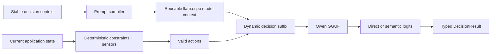

# Architecture

Status: active  
Owner: repository

## System intent

Decisio is a stateful local decision runtime. It separates a **stable decision context** from
**changing application state**, restores an exact reusable llama.cpp model-context snapshot where
safe, then reads a bounded typed action without an autoregressive answer loop.

The application removes deterministically invalid actions first. Decisio owns the remaining
probabilistic choice, scorer semantics, reuse correctness, provenance and probability status.
Qwen3.5-2B Q4_K_M is the pinned CPU evidence artifact, not a permanent model restriction.

## Constraint boundary

Decisio chooses among **valid alternatives**; it does not replace deterministic rules.

```text
raw domain state + raw actions
            |
            v
 deterministic/domain constraints
            |
            v
       valid candidates
            |
            v
          Decisio
            |
            v
  semantic preference among them
```

Examples include geometry, schema validity, hard policy requirements, resource bounds, and other conditions whose truth is already known deterministically. The owning application is responsible for those constraints. If exactly one valid alternative remains, callers may resolve it without model inference.

This boundary avoids spending model compute on impossible options and prevents a probabilistic scorer from overruling facts such as "this move hits a wall."

## Reference runtime

The canonical implementation path is now an in-process llama.cpp backend over local GGUF artifacts.
The older PyTorch/Transformers adapter is retained only to reproduce the superseded scorer-gate-v1
methodology. It is not exported from `decisio.backends`, is not used by active workflows, and is not
a supported runtime path. Representative evidence is tied to the pinned llama.cpp/GGUF identity.

The target boundary is:



llama.cpp owns model execution, quantized kernels, context/batch/sequence mechanics and device
support. Decisio owns prompt/scorer semantics, deterministic constraints boundary, probability
status, provenance, evaluation and the eventual calibration layer.

The backend accepts `cpu` and optional `metal` execution. Metal uses the same GGUF scorer and
complete sequence-state reuse path, with all model layers and K/Q/V tensors requested for GPU
offload in both llama.cpp contexts. Startup fails when Metal is requested from an unsupported host
or binding. Device and offload settings are part of runtime identity; the pinned evidence path
remains CPU until a separate Metal equivalence and performance run is recorded.

Representative evidence must bind to the exact GGUF SHA-256, quantization and llama.cpp
runtime/build identity. BF16/Transformers results are not treated as equivalent to Q4_K_M results.

## Current implementation architecture

Current code owners:

| Concern | Current owner |
| --- | --- |
| Request/result contracts | `src/decisio/schema.py` |
| Prompt compilation | `src/decisio/compiler.py` |
| Semantic and letter scoring | `src/decisio/scorers/` |
| Supported high-level direct-choice session | `src/decisio/session.py` |
| Canonical local GGUF / llama.cpp runtime and shared-state execution | `src/decisio/backends/llama_cpp.py` |
| Historical scorer-gate-v1 Transformers reproduction adapter | `src/decisio/backends/qwen.py` |
| Benchmark execution | `src/decisio/benchmark.py` |
| Paired scorer comparison | `src/decisio/comparison.py` |
| CLI | `src/decisio/cli.py` |

`DecisionSession` is the supported high-level Python boundary for the direct stateful choice path.
It owns backend construction/lifecycle, fixes one decision context per session, accepts changing
state plus valid candidates, exposes reuse versus same-prompt fresh execution, and attaches runtime
reuse metrics to `DecisionResult`. It intentionally does not expose semantic-scorer selection,
answerability or calibration.

The low-level runtime continues to support exact compiler-marked prefix reuse through full llama.cpp
sequence-state snapshot/restore. Snake remains the first stateful application reference: its fixed
controller contract is the reusable prefix; current board state and deterministic action sensors are
the changing suffix.

## Stateful decision flow

```text
stable decision context
        |
    prefill once
        |
 reusable model context
        |
        +---- current state t   + valid actions + sensors -> logits -> typed action
        +---- current state t+1 + valid actions + sensors -> logits -> typed action
        +---- current state t+2 + valid actions + sensors -> logits -> typed action
```

The optimized path is valid only when it remains equivalent to fresh evaluation under the declared
runtime tolerance. A cache hit is an implementation event, not evidence of correctness.

## Direct choice readout

For small bounded action sets, Decisio can compile all valid candidates once as A/B/C/... options and
read the corresponding next-token logits from a single model evaluation:

```text
state + question + options
          |
          v
   one model evaluation
          |
          v
 logits(A/B/C/...)
          |
          v
 relative softmax
          |
          v
    DecisionResult
```

This is implemented by `LetterTokenScorer` and is the action readout used by the stateful Snake reference. It generates zero answer tokens and avoids one YES/NO evaluation per candidate. Direct logits are an internal primitive, not the product differentiator; option-order sensitivity and uncalibrated probability semantics remain explicit.

`LetterTokenScorer(..., reuse_prefix=True)` marks an exact token prefix for model-context reuse.
The generic scorer keeps this explicit; Snake selects it by default and offers `--fresh-prefix` as
the same-prompt oracle. Native batch-aligned checkpoint rules still apply. Prompt shape and caching
are evaluated separately: cached and fresh execution of the same stateful prompt must agree before
reuse is accepted.

## Comparative semantic scoring

For each candidate `c_i`, compile a binary comparative judgment whose valid readout is `YES` versus `NO`. The prompt includes the complete alternative set and asks whether `c_i` is the best answer among those alternatives.

The raw candidate score is:

```text
score_i = logit(YES | state, question, alternatives, candidate_i)
        - logit(NO  | state, question, alternatives, candidate_i)
```

The semantic scorer also preserves the model's binary conditional support:

```text
binary_conditional_probability_i
  = softmax([logit(YES), logit(NO)])[YES]
```

This answers “how strongly does the model prefer YES over NO for this candidate under this
binary readout?” It is not calibrated probability of correctness.

For mutually exclusive choice candidates, derive a separate relative distribution:

```text
P_i = softmax(score_1 ... score_n)
```

This distribution is conditional on the supplied candidates and **must not be described as calibrated probability of correctness** unless a validated calibration layer is explicitly active.

## Answerability (planned)

Answerability is intended to be modeled separately:

```text
Does the supplied evidence contain enough information to answer this question?
YES / NO
```

The result exposes the answerability signal independently from the choice distribution.

This avoids forcing "insufficient evidence" to compete semantically with ordinary candidates and enables downstream policies such as:

```text
if answerability < threshold:
    escalate / request more evidence
else:
    use candidate distribution
```

Thresholds are application policy, not universal Decisio truth.

## Baselines

The benchmark harness should implement at least two baselines:

### Direct answer-token scoring

Map candidates to answer slots such as A/B/C and read their next-token logits in one model evaluation. This is both a benchmark baseline and an available low-latency native path for bounded controls such as Snake.

### Autoregressive structured output

Ask the same reference model to generate the smallest valid structured answer. This measures the systems cost and semantic differences introduced by generation.

Benchmark baselines remain evidence tools first. The failed short/fresh semantic-v2 gate means the repository does not currently claim one universal public default scorer; applications should select a readout only within the scope supported by evidence.

## Shared context-state execution

Shared execution is a v1 runtime requirement because repeated prefilling can dominate local CPU
latency. The runtime must reuse **model context state**, not assume a classic KV-only cache: Qwen3.5
mixes attention with recurrent/DeltaNet-style state.

The reuse hierarchy is:

```text
stable decision context -> reusable model context -> changing state/question -> readout
```

Semantic candidate branching remains a second scoped use of the same exact snapshot/restore primitive.

The semantic scorer exposes an optional backend fast path,
`shared_prefix_batch_next_token_logits`. The compiler can also mark a token-safe reusable state
prefix. The llama.cpp backend keeps one canonical sequence, snapshots complete sequence state,
restores candidate branches from that state, and keeps repeated-state checkpoints in an LRU bounded
by both entry count and serialized bytes. Keys are exact token prefixes within one loaded runtime;
unsupported boundaries fall back to ordinary shared-prefix evaluation.
Candidate branches execute serially on sequence 0, so their count is not limited by
`max_sequences`. Native batch-aligned checkpoint requirements still apply; prompts without
a safe checkpoint fall back to fresh evaluation.

Fresh evaluation remains the correctness oracle. Shared execution reports changed choices,
score/probability deltas, logical versus physical tokens, snapshot/restore bytes and cache hits.

## Target component map

The following owners are planned, not current public API commitments.

| Concern | Proposed owner | Responsibility |
| --- | --- | --- |
| Public schemas | `src/decisio/schema.py` | requests, candidates, decisions, metadata |
| Prompt/scoring compiler | `src/decisio/compiler.py` | deterministic scoring text/tokens and readout tokens |
| Scorer interface | `src/decisio/scorers/` | semantic binary scorer and experimental baselines |
| Model adapters | `src/decisio/models/` | model-specific load/token/cache/logit capabilities |
| Runtime engine | `src/decisio/engine.py` | orchestration, batching, cache reuse |
| Post-processing | `src/decisio/decision.py` | log-odds, normalization, answerability, policies |
| API/CLI | `src/decisio/api.py`, `cli.py` | stable user entry points |
| Evaluation | `benchmarks/` | frozen data, runners, metrics, reports |
| Calibration | `src/decisio/calibration.py` | later optional post-hoc calibration |

Names are proposed. Implemented owners are listed in **Current implementation architecture** above.

## Public decision primitives

### v1

- `boolean`
- `choice`
- answerability for both

### later, only after semantics are validated

- ordinal `score`
- numeric/distributional estimates
- ranking/top-k
- multi-label decisions

Do not implement every type by disguising it as choice unless the semantics and evaluation support that decision.

## Probability semantics

Semantic results expose two distinct uncalibrated probability-like quantities:

- `binary_conditional_probability` — candidate-local YES-vs-NO model support;
- `distribution` — relative normalization across the supplied candidates.

Neither is calibrated probability of correctness.

Every result must carry a status such as:

- `uncalibrated_conditional_scores`
- `temperature_scaled`
- a future validated calibration identifier

The API should expose raw candidate scores in debug/audit mode and always expose the scorer identity.

## Model abstraction

The model adapter must describe capabilities explicitly rather than assume every causal LM supports identical optimizations. llama.cpp/GGUF is the canonical v1 path; additional runtimes remain optional future adapters.

Relevant capabilities include:

- next-token logits;
- exact readout-token verification;
- prefix/state cache creation;
- cache branching/batching;
- selected-vocabulary projection if available;
- quantization mode;
- maximum context;
- backend/device.

Qwen 3.5 2B is the reference implementation, not a permanent dependency boundary.

## Runtime priorities

1. fresh-equivalent reuse of stable decision context on the pinned llama.cpp/GGUF path;
2. direct typed action readout over current state plus deterministic sensors/valid actions;
3. explicit physical-vs-logical token, latency, cache and provenance evidence;
4. answerability/abstention after the stateful control loop is proven;
5. semantic-v2 and additional runtime/quantization experiments only within evidence-supported scopes.

## Trust and data boundaries

The initial product is local-first. State/evidence is processed by the locally loaded model/runtime and is not sent to a hosted Decisio service.

External model downloads remain governed by the upstream model host and cache tooling.

Benchmark artifacts must avoid embedding sensitive user data.

## Key invariants

- generated answer tokens = 0 on native Decisio scoring paths;
- no silent input truncation;
- deterministic invalid candidates are excluded before semantic scoring when the caller can know validity exactly;
- candidate IDs remain independent from their rendered order;
- scoring/readout tokens are validated against the tokenizer;
- uncalibrated values are labeled as such;
- every benchmark record includes model revision, scorer version, prompt/compiler hash, runtime/backend and timing scope;
- optimized shared execution is compared against a fresh reference path;
- deterministic post-processing for identical logits.

## Architecture questions intentionally left open

These should be answered by evidence rather than preference:

- best binary verbalizer pair (`YES/NO`, alternatives, or multi-verbalizer aggregation);
- whether state-only versus state+question prefix reuse gives the best quality/throughput trade-off;
- whether option scoring should include explicit negative framing or pairwise comparisons;
- whether hidden-state scoring can improve over logit verbalizers without training;
- how much post-hoc calibration helps without task-specific training;
- when an optional trained adapter becomes justified.


## Current implementation boundary

The canonical path is local GGUF through llama.cpp. The backend snapshots/restores complete
single-sequence model context state and keeps exact compiler-marked checkpoints in a byte-bounded
LRU. This deliberately avoids a KV-only assumption for hybrid/recurrent Qwen3.5 state.

Snake now uses a fixed decision contract as the reusable direct-scoring prefix and sends only current
world state plus deterministic candidate sensors on each model decision. The same prompt can be run
fresh with `--fresh-prefix`; exact-head real-model evidence must prove output equivalence and physical
token reduction before the stateful path supports a performance claim. Semantic candidate reuse
remains a separate experimental scope.
