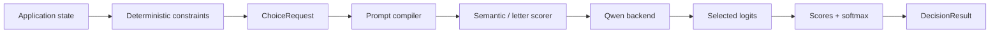

# Repository quality and hardening

Status: active improvement plan  
Owner: repository

## Purpose

This document tracks the work required to make Decisio a repository that is easy to understand, try, trust, integrate and contribute to.

It is intentionally **vertical**. The question is not whether every folder has enough documentation. The question is whether a new developer can move cleanly through this path:

```text
discover Decisio
      ↓
understand why it exists
      ↓
run one real decision
      ↓
understand the result
      ↓
trust the benchmark evidence
      ↓
integrate the library
      ↓
contribute without learning hidden rules
```

Product capability remains owned by `docs/product.md` and `docs/roadmap.md`. This document owns repository usability, reproducibility, documentation quality and engineering hardening.

## Target repository experience

A strong Decisio repository should make these things obvious without requiring tribal knowledge:

- what Decisio does and what it deliberately does not do;
- why scoring candidates can be preferable to generating structured text;
- what is implemented today versus still experimental;
- the shortest supported path to a working result;
- the current architecture and the intended next architecture;
- what a score means and what it does **not** mean;
- how benchmark claims were produced and how to reproduce them;
- which parts belong to Decisio and which evaluation responsibilities belong to Performance Lab;
- how to make a safe contribution and validate it.

The repository should prefer short explanations, executable examples and diagrams over repeated prose.

## Current assessment

| Area | Current state | Main gap |
| --- | --- | --- |
| Product story | Strong on the product branches | default `main` still presents the inherited template |
| Core code | Small and readable | public integration surface is still low-level |
| Architecture | Clear thesis and invariants | current implementation and target architecture are mixed together |
| Examples | Useful and executable | no single cheap first-run path is presented as the canonical onboarding flow |
| Correctness evidence | Good for the current stage | more adversarial contract tests are needed |
| Performance evidence | Directional only | timing methodology is not yet strong enough for a stable performance decision |
| Reproducibility | Model revision and fixtures are pinned | dependency environment is not locked |
| Contributor experience | CI and agent guidance exist | contributor/security/license surfaces are incomplete |
| Repository hygiene | Product-specific material exists | substantial `repo-template-sw` residue remains |
| Release readiness | Correctly experimental | no stable public API/release contract yet |

## 1. Discover and understand

### What already works

The product thesis, non-goals and evidence-first roadmap are clear. The README explains the distinction between generation and scoring, and the ADRs preserve why important decisions were made.

### What blocks a strong first impression

The default branch still reads as `repo-template-sw`, while the actual Decisio product lives on stacked draft branches. A visitor therefore sees the wrong identity before seeing the product.

The README also asks the reader to absorb several concepts before showing the shortest useful interaction.

### Required outcome

The default branch must lead with:

1. one-sentence product identity;
2. one visual mental model;
3. one minimal runnable example;
4. one example result with its semantics;
5. current status and limitations;
6. links to architecture, benchmarks and examples.

The README should explain the product, not become the complete product manual.

> **IMAGE PLACEHOLDER — README hero diagram**  
> A clean two-column graphic. Left: “Generated decision” showing prompt → autoregressive JSON → parse/repair → application. Right: “Decisio” showing state + question + candidates → logit scoring → typed decision. Emphasize zero answer generation and runtime-defined candidates. Avoid benchmark numbers until representative evidence exists.

## 2. Run the project successfully

### What already works

The CLI has direct `score`, `benchmark` and `compare` commands. Support routing, policy gate and Snake provide real examples.

### Gaps

- the default reference model is intentionally 4B and can be expensive for a first run;
- dependency versions are not locked with `uv.lock`;
- setup requirements and expected hardware behavior are spread across documents;
- there is no explicit “cheap smoke” onboarding path distinct from representative evidence.

### Required outcome

There should be one canonical first-run sequence with no hidden setup:

```text
install
  ↓
run a cheap functional smoke
  ↓
inspect a typed result
  ↓
optionally run the representative CUDA path
```

The cheap path must be labeled functional/directional and never confused with product evidence.

Acceptance:

- supported Python version and install command are obvious;
- dependency resolution is reproducible;
- the first example includes expected output shape;
- CPU/small-model limitations are stated beside the command that uses them;
- representative benchmark commands remain separate from onboarding.

## 3. Trust the result and the benchmark

### What already works

Decisio already has unusually good evidence foundations for its age:

- exact Qwen revision;
- frozen benchmark inputs with SHA-256;
- raw result retention;
- scorer and prompt identity;
- generated-token accounting;
- paired correctness comparison;
- order perturbation;
- CI real-model smoke clearly labeled as directional.

### Critical gap before the 4B/CUDA scorer gate

Correctness methodology is stronger than the current performance methodology. A single wall-clock measurement per example, with scorers executed in a fixed order, is not sufficient evidence for a stable latency claim.

Before using performance as a promotion gate, the representative harness should define:

- explicit warm-up;
- repeated measured runs;
- CUDA synchronization around timed sections;
- balanced or interleaved scorer execution order;
- p50 and p95 latency;
- total throughput / decisions per second;
- peak GPU memory where practical;
- exact timing scope;
- hardware/runtime identity in the report.

The benchmark must separate:

```text
semantic quality evidence
          +
robustness evidence
          +
systems performance evidence
```

rather than letting one noisy latency number decide the architecture.

> **IMAGE PLACEHOLDER — benchmark matrix**  
> A four-lane diagram for semantic v2, semantic v1, letters and generated JSON. Each lane receives the exact same frozen request set, runs normal + reversed order, then converges into quality, robustness and systems metrics. Clearly mark generated JSON as the only autoregressive baseline.

## 4. Integrate Decisio as a library

### What already works

The internal boundaries are simple: schema, compiler, scorers, backends and benchmark tooling are separated without framework-heavy abstractions.

### Gaps

The current public package exports data contracts, but consumers still need to know implementation classes such as the Qwen backend and semantic scorer.

Input contracts are also more permissive than the effective runtime contract. Examples include coercing unexpected values with `str(...)`, accepting JSON-incompatible `state` until compilation, and leaving tie behavior implicit.

### Required outcome

After the scorer gate establishes the default semantics, provide one stable library entry point that hides experimental wiring.

The public contract should own:

- model/backend construction;
- `choice` first, then `boolean`;
- strict input validation;
- deterministic tie behavior;
- explicit error types;
- no silent truncation;
- probability-status semantics;
- model/scorer provenance.

Do **not** freeze this API before the scorer decision gate. The goal is a small stable surface, not another abstraction layer.

## 5. Understand the architecture

### Current implementation



This is the architecture that exists today.

### Documentation gap

`docs/architecture.md` also describes future owners such as an engine, decision layer, model adapters and API modules that are not implemented yet. The ideas are useful, but current and target architecture must be visually and textually separated.

### Required outcome

Architecture documentation should always contain two explicit sections:

- **Current architecture** — code that exists on the referenced branch;
- **Target architecture** — intended boundaries that are still conditional on evidence.

Every component named in the current diagram should map to a real source owner. Planned modules must be labeled planned.

> **IMAGE PLACEHOLDER — polished architecture overview**  
> Replace the Mermaid overview only when the architecture stabilizes. Show three ownership bands: application/domain constraints, Decisio semantic decision layer, model runtime. Add a side rail for provenance/evidence. Do not imply answerability or shared-prefix reuse is implemented until it is.

## 6. Maintain, reproduce and contribute

### Current gaps

The repository was bootstrapped from `repo-template-sw`. Root engineering ownership is now being specialized into `.engineering/`, `skills/`, `scripts/` and repository workflows; the embedded `template/` tree is baseline source material, not Decisio product documentation.

The repository currently lacks:

- `.engineering/baseline.json`;
- `.engineering/commands.json`;
- `.engineering/e2e.json`;
- `LICENSE`;
- `CONTRIBUTING.md`;
- `SECURITY.md`;
- `uv.lock`.

This is more than cosmetic cleanup. It makes repository authority ambiguous and reduces reproducibility.

### Required outcome

The repository should be self-contained and product-specific:

- keep the engineering baseline specialized in root-owned `.engineering/`, `skills/`, `scripts/` and workflows;
- keep template source material out of the Decisio documentation/navigation surface;
- add a dependency lock and deterministic setup path;
- add license, contribution and security guidance;
- document canonical validation commands;
- keep `docs/current-state.md` exact and fresh;
- keep release history about Decisio, not about the template used to bootstrap it.

## Implementation progress

| ID | State on this branch | Evidence / remaining work |
| --- | --- | --- |
| RQ-01 | IMPLEMENTED, evidence pending | repeated balanced performance trials, CUDA synchronization, throughput and peak-memory reporting are implemented; representative 4B/CUDA run still required |
| RQ-02 | PENDING | default branch still needs branch convergence/merge |
| RQ-03 | IN PROGRESS | root baseline, commands, E2E, skills and verifier scripts are specialized; repository-health validation and root template-doc removal are being completed |
| RQ-04 | IMPLEMENTED | committed `uv.lock`, frozen setup commands and CI lock verification |
| RQ-05 | IMPLEMENTED | Apache-2.0 `LICENSE` added |
| RQ-06 | IMPLEMENTED for current choice contract | strict strings/JSON state, finite result validation, duplicate-description rejection and deterministic ties |
| RQ-07 | IMPLEMENTED | architecture now separates current owners from planned target components |
| RQ-08 | BLOCKED BY SCORER GATE | stable high-level Python API intentionally waits for scorer semantics |
| RQ-09 | IMPLEMENTED | README is reorganized around identity, quickstart, semantics, status and deeper docs |
| RQ-10 | IMPLEMENTED | concise `CONTRIBUTING.md` and `SECURITY.md` added |
| RQ-11 | PARTIAL | malformed contracts, numerical edge cases and exact ties are covered; backend/tokenizer/context-limit negatives can expand later |
| RQ-12 | PRESERVED | benchmark methodology keeps internal scorer evidence in Decisio and external endpoint evaluation in Performance Lab |
| RQ-13 | PLACEHOLDERS ADDED | README and repository-quality docs specify the required future visuals; polished assets wait for stable semantics |
| RQ-14 | PARTIAL | Decisio-specific version/changelog exist; release package workflow remains future work |

## Improvement backlog

Priority meanings:

- **P0** — required before relying on the repository for the next major architectural decision or merging the product foundation to the default branch;
- **P1** — required before presenting Decisio as a solid developer-facing project;
- **P2** — valuable after the core scorer/API semantics stabilize.

| ID | Priority | Improvement | Done when |
| --- | --- | --- | --- |
| RQ-01 | P0 | Strengthen representative benchmark timing | warm-up, repeats, CUDA sync, balanced execution, latency distribution, throughput and memory/provenance are recorded |
| RQ-02 | P0 | Make the default branch Decisio | product foundation and scorer-gate work converge; GitHub landing page no longer presents `repo-template-sw` |
| RQ-03 | P0 | Finish repository-template specialization | baseline/commands/e2e configuration is project-owned and template-only root material is removed or intentionally retained |
| RQ-04 | P0 | Make setup reproducible | `uv.lock` exists and CI/setup use a coherent dependency contract |
| RQ-05 | P0 | Complete legal/basic trust surface | Apache-2.0 `LICENSE` exists; public claims match repository status |
| RQ-06 | P1 | Harden request/result contracts | bad types, non-serializable state, non-finite scores/distributions, ambiguous candidates and deterministic ties have explicit behavior and tests |
| RQ-07 | P1 | Separate current vs target architecture | architecture doc maps implemented components to source and labels planned components unambiguously |
| RQ-08 | P1 | Create one stable Python entry point | after scorer gate, normal users do not assemble backend + scorer internals manually |
| RQ-09 | P1 | Rewrite README around the shortest success path | identity → mental model → quickstart → result semantics → status → deeper docs |
| RQ-10 | P1 | Add contributor and security guidance | `CONTRIBUTING.md` and `SECURITY.md` describe setup, validation, reporting and evidence expectations concisely |
| RQ-11 | P1 | Expand negative/contract tests | public boundaries are tested for malformed inputs, tokenizer/backend mismatches, ties and numerical edge cases |
| RQ-12 | P1 | Keep evidence ownership clean | internal scorer evidence stays in Decisio; externally served endpoint evaluation remains in Performance Lab |
| RQ-13 | P2 | Add polished explanatory graphics | README hero, architecture overview and benchmark matrix replace placeholders after semantics stabilize |
| RQ-14 | P2 | Establish release-facing package workflow | package/install smoke, versioning and Decisio-specific changelog are proven before a non-alpha release |

## Sequencing

The repository should not try to complete every item at once.

### Before the representative 4B/CUDA gate

Focus on:

- RQ-01 benchmark timing rigor;
- RQ-04 reproducible dependency environment where it affects evidence;
- RQ-06/RQ-11 only for invariants that could invalidate benchmark results.

### Before merging the product foundation to the default branch

Focus on:

- RQ-02 default-branch identity;
- RQ-03 template specialization;
- RQ-05 license;
- documentation/current-state freshness.

### After the scorer decision

Focus on:

- RQ-07 architecture stabilization;
- RQ-08 public Python API;
- RQ-09 README simplification;
- RQ-10 contributor/security docs;
- RQ-13 polished visuals.

## Documentation and visual rules

Repository documentation should follow these rules:

- lead with the answer, then explain;
- prefer one canonical explanation over the same explanation in five files;
- distinguish **implemented**, **experimental**, **planned** and **evidence pending**;
- use code and diagrams where they remove prose;
- do not use decorative graphics that make technical claims;
- never draw performance charts from illustrative data;
- every benchmark figure must point to retained machine-readable evidence;
- use Mermaid for living architecture while boundaries change;
- replace Mermaid with polished static artwork only when the diagram has become stable enough to justify maintenance.

## Definition of repository success

Decisio reaches the desired repository quality when a new technical user can, from the default branch:

1. understand the product boundary from the README;
2. run a supported smoke path without discovering undocumented prerequisites;
3. understand the returned score semantics without reading source code;
4. locate the current architecture and see which parts are planned;
5. reproduce a benchmark from pinned inputs/runtime identity;
6. tell directional CI evidence from representative product evidence;
7. integrate through a small public API instead of experimental internals;
8. find contribution, validation, security and license information directly;
9. see no inherited template material presented as Decisio product truth.

That is the target. More documentation is not the goal; **less ambiguity is**.
